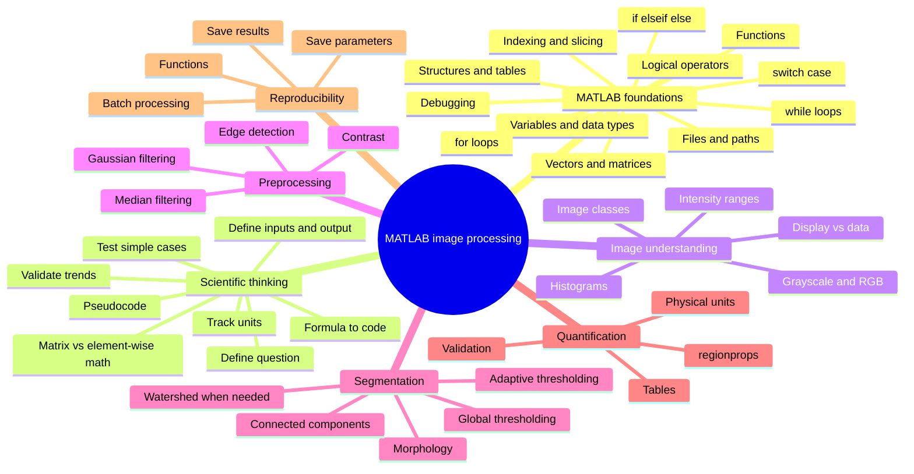

# MATLAB Image Processing: A Practical Beginner Course

**Author: Md. Mobarak Karim, Ph.D.**

A self-contained beginner-to-practical course for learning **MATLAB, scientific programming, and image processing together**.

You do **not** need previous MATLAB experience. The course begins with programming fundamentals, scientific problem solving, and translating mathematical equations into MATLAB before moving into image processing, segmentation, quantitative measurements, and batch workflows.

## Learning philosophy

The course is designed around understanding rather than memorizing commands.

For programming and scientific equations, use this sequence:

```text
question -> concept/equation -> inputs/units -> pseudocode -> MATLAB -> test -> validate -> apply
```

For image analysis, use this sequence:

```text
question -> inspect data -> preprocess only if needed -> segment -> validate -> measure -> save
```

For every important operation, ask:

1. What problem am I trying to solve?
2. What are the inputs and desired output?
3. What equation or logical rule describes the problem?
4. How should that rule be translated into MATLAB?
5. Which function is appropriate, and why?
6. Which parameter controls its behavior?
7. How will I validate the result?

## Why `.m` files instead of `.mlx`?

MATLAB Live Scripts (`.mlx`) are binary files and are not ideal for source-code review on GitHub. These lessons use ordinary MATLAB scripts with `%%` section markers.

In the MATLAB Editor, each `%%` section can be run independently, similar to a notebook cell. You can execute one section, inspect variables, change values, and rerun it.

If you prefer Live Editor, open a lesson in MATLAB and save your own copy as a Live Script.

## Learning map



## Course order

| Lesson | Topic | Main ideas |
|---|---|---|
| [`00_setup_and_workflow.m`](00_setup_and_workflow.m) | Setup and workflow | MATLAB Editor, sections, workspace, paths, toolboxes, reproducible workflow |
| [`01_matlab_foundations_for_images.m`](01_matlab_foundations_for_images.m) | **MATLAB foundations + scientific thinking** | Variables, types, vectors/matrices, indexing, logic, loops, functions, equations, debugging, images as arrays |
| [`02_read_display_and_image_types.m`](02_read_display_and_image_types.m) | Read/display/types | `imread`, grayscale/RGB, class, ranges, display vs data |
| [`03_contrast_histograms_and_intensity.m`](03_contrast_histograms_and_intensity.m) | Histograms + contrast | `imhist`, percentiles, `imadjust`, local enhancement |
| [`04_filtering_noise_and_edges.m`](04_filtering_noise_and_edges.m) | Filtering + edges | Gaussian, median, gradients/edges, parameter trade-offs |
| [`05_thresholding_and_morphology.m`](05_thresholding_and_morphology.m) | Thresholding + morphology | Global/adaptive thresholding, cleanup, holes, structuring elements |
| [`06_segmentation_and_labels.m`](06_segmentation_and_labels.m) | Segmentation + labels | Connected components, labels, overlays, watershed concepts |
| [`07_measurements_and_tables.m`](07_measurements_and_tables.m) | Measurements | `regionprops`, tables, intensity/shape metrics, physical units |
| [`08_color_and_multichannel_images.m`](08_color_and_multichannel_images.m) | Color + multichannel | RGB vs scientific channels, channel-specific analysis |
| [`09_batch_processing_pipeline.m`](09_batch_processing_pipeline.m) | Batch processing | Functions, `dir`, `fullfile`, reusable pipelines, saving results |
| [`10_final_project.m`](10_final_project.m) | Final project | End-to-end segmentation, validation, measurement, parameter recording |

## Lesson 01 is the standalone MATLAB prerequisite

`01_matlab_foundations_for_images.m` is intentionally much more detailed than later lessons. It teaches the MATLAB language needed for the rest of the course, including:

- statements, comments, sections, and semicolons,
- variables and meaningful scientific variable names,
- numeric types, strings, logical values, and type conversion,
- vectors, matrices, cell arrays, structures, and tables,
- MATLAB's **1-based indexing**,
- slicing and the colon operator,
- comparison and Boolean logic,
- `if / elseif / else`,
- `switch / case`,
- `for` and `while` loops,
- `break` and `continue`,
- functions and local functions,
- anonymous functions,
- function inputs and outputs,
- file paths and `fullfile`,
- `try / catch`, `assert`, and debugging,
- pseudocode and problem decomposition,
- translating equations into MATLAB,
- distinguishing matrix operations from `.*`, `./`, and `.^`,
- checking units and expected physical trends,
- arrays, logical masks, vectorization, and images as matrices.

The objective is not merely to learn MATLAB syntax, but to learn how to convert an idea, mathematical equation, or experiment into reliable code.

## Requirements

The MATLAB-language fundamentals require MATLAB. Most image-processing lessons use **Image Processing Toolbox**.

Useful checks:

```matlab
ver
which imread
which imshow
which imgaussfilt
which imbinarize
which regionprops
```

If an image-processing function is missing, check whether Image Processing Toolbox is installed and licensed.

## Important MATLAB habits

- MATLAB indexing starts at **1**, not 0.
- Images are usually indexed as `image(row, column)`.
- `*`, `/`, and `^` are matrix operations.
- Use `.*`, `./`, and `.^` for element-by-element equations.
- A semicolon suppresses Command Window output.
- Use descriptive variable names and include units when useful, e.g. `pixelSize_um`.
- Inspect `size`, `class`, minimum, maximum, and visualization before processing.
- Validate segmentation against the original image before trusting measurements.

## Companion guides

- [`CHEATSHEET.md`](CHEATSHEET.md) — quick MATLAB syntax reference.
- [`FUNCTION_GUIDE.md`](FUNCTION_GUIDE.md) — which image-processing function to try, why, important parameters, and what to inspect.
- [`REFERENCES.md`](REFERENCES.md) — official documentation and course references.

## Data policy

Use copies of research images for learning and development. Keep authoritative raw data unchanged and backed up separately. Do not commit private, patient, unpublished, or proprietary data to a public repository.

## Official documentation

- MATLAB language fundamentals: https://www.mathworks.com/help/matlab/language-fundamentals.html
- MATLAB matrices and arrays: https://www.mathworks.com/help/matlab/matrices-and-arrays.html
- MATLAB programming: https://www.mathworks.com/help/matlab/programming-and-data-types.html
- Image Processing Toolbox: https://www.mathworks.com/help/images/

## Author

**Md. Mobarak Karim, Ph.D.**  
GitHub: [Mobarak-Karim](https://github.com/Mobarak-Karim)

## License

New course material in this repository is released under the MIT License. See `LICENSE`.
